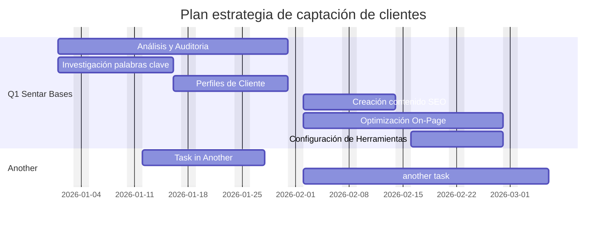

# Estrategia de Captación:

Para captar nuevos clientes, EcoSmart debe desarrollar una estrategia que optimice varios canales digitales, con el fin de llegar a clientes potenciales en diferentes etapas de su proceso de decisión.

 

