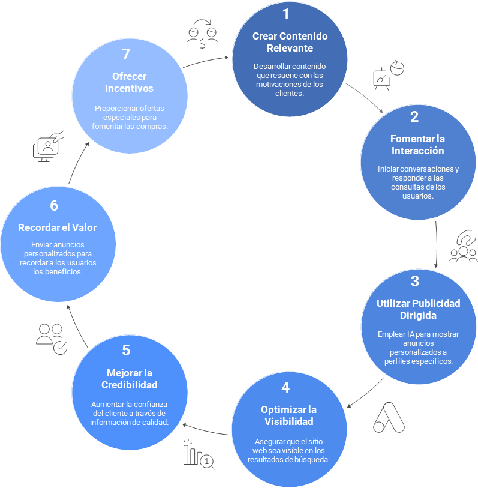
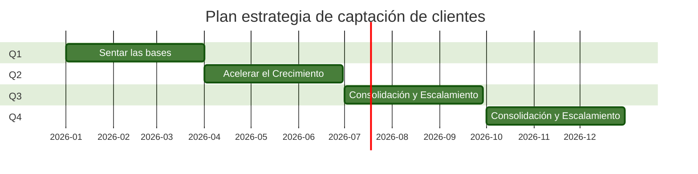

# Estrategia de Captación:

Para captar nuevos clientes, EcoSmart debe desarrollar una estrategia que optimice varios canales digitales, con el fin de llegar a clientes potenciales en diferentes etapas de su proceso de decisión.

 

---

A continuación, se presenta un roadmap de 12 meses para la implementación de la estrategia de captación de EcoSmart, dividida en trimestres y enfocada en la optimización de canales digitales, SEO y remarketing.

