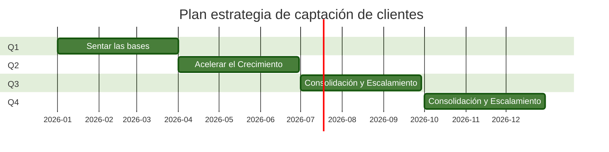

# Estrategia de Captación:

Para captar nuevos clientes, EcoSmart debe desarrollar una estrategia que optimice varios canales digitales, con el fin de llegar a clientes potenciales en diferentes etapas de su proceso de decisión.

Algunos pasos para contemplar en esta estrategia:

 

---

A continuación, se presenta un roadmap de 12 meses para la implementación de la estrategia de captación de EcoSmart, dividida en trimestres y enfocada en la optimización de canales digitales, SEO y remarketing.

## Trimestre 1: Sentar las Bases (Meses 1-3)

El enfoque de este trimestre es la preparación y el lanzamiento de las bases de la estrategia.

**Mes 1**:

*   Análisis y Auditoría: Realizar una auditoría completa del sitio web y las redes sociales de EcoSmart para identificar áreas de mejora.

*   Investigación de Palabras Clave: Realizar una investigación exhaustiva de palabras clave para identificar términos relevantes en el ámbito de la sostenibilidad, el ahorro de energía y la domótica.

*   Perfiles de Cliente: Definir los perfiles de cliente clave ("El Eco-Activista", "El Buscador de Eficiencia", etc.) y sus puntos de dolor para guiar la creación de contenido.

**Mes 2**:

*   Creación de Contenido SEO: Comenzar la creación de contenido de alta calidad y educativo (artículos de blog, guías, infografías) optimizado con las palabras clave identificadas.

*   Optimización On-Page: Implementar mejoras técnicas en el sitio web (velocidad de carga, experiencia móvil, optimización de meta-títulos) para mejorar el posicionamiento en buscadores.

*   Configuración de Herramientas: Configurar las plataformas de publicidad (ej., Google Ads, Meta Ads) y las herramientas de análisis web (ej., Google Analytics) para un correcto seguimiento de las campañas.

**Mes 3**:

*   Lanzamiento de Contenido: Publicar el contenido SEO creado y distribuirlo a través de las redes sociales.

*   Lanzamiento de Campañas de Consciencia: Lanzar campañas publicitarias en redes sociales dirigidas a un público amplio para generar reconocimiento de la marca.

*   Inicio de la Recopilación de Datos: Empezar a recopilar datos para los públicos de remarketing.

## Trimestre 2: Acelerar el Crecimiento (Meses 4-6)

En este trimestre se optimizan las campañas y se enfoca en la conversión de clientes potenciales.

**Mes 4**:

*   Análisis de Datos: Analizar el rendimiento del contenido y las campañas del primer trimestre. Identificar qué temas resuenan más con la audiencia.

*   Lanzamiento de Campañas de Remarketing: Lanzar las primeras campañas de remarketing dirigidas a los usuarios que visitaron el sitio web pero no compraron. El mensaje debe centrarse en los beneficios clave de los productos y ofrecer incentivos.

*   Desarrollo de Contenido Interactivo: Iniciar la creación de contenido más interactivo, como cuestionarios o calculadoras de ahorro de costos, para aumentar el compromiso.

**Mes 5**:

*   Optimización de Anuncios: Realizar pruebas A/B en los anuncios de redes sociales y Google para identificar los mensajes y creatividades más efectivos.

*   Creación de Contenido Específico: Desarrollar contenido más especializado (estudios de caso, testimonios) que aborde las dudas de los clientes en la etapa de evaluación de alternativas.

**Mes 6**:

*   Evaluación del Impacto: Medir los KPIs (tasa de conversión, coste por adquisición) y comparar los resultados con los objetivos definidos en el plan de OKRs.

*   Refinar la Estrategia: Ajustar las campañas de marketing y la estrategia de contenido en función de los resultados obtenidos.

## Trimestre 3: Consolidación y Escalamiento (Meses 7-9)

El objetivo es consolidar los resultados obtenidos y escalar las campañas exitosas.

**Mes 7**:

*   Expansión de Palabras Clave: Ampliar la investigación de palabras clave a términos de nicho para captar audiencias más específicas.

*   Colaboraciones: Iniciar contacto con influencers o micro-influencers en el sector de la sostenibilidad para colaboraciones y menciones.

**Mes 8**:

*   Optimización de Embudo: Enfocarse en la optimización del embudo de ventas, desde la primera interacción hasta la compra. Se pueden utilizar chatbots para guiar a los personas clave en el proceso.

*   Campañas de Fidelización: Lanzar las primeras campañas de fidelización (email marketing, notificaciones) para mantener a los clientes ya adquiridos comprometidos.

**Mes 9**:

*   Análisis de Rendimiento: Evaluar el rendimiento global de la estrategia y la contribución de cada canal al crecimiento del negocio.

*   Reporte Trimestral: Preparar un informe completo con el estado de los OKRs y los aprendizajes para el próximo ciclo.

## Trimestre 4: Innovación y Crecimiento Sostenido (Meses 10-12)

En este último trimestre, se implementan nuevas tecnologías y se planifica el crecimiento a largo plazo.

**Mes 10**:

*   Exploración de Nuevas Tecnologías: Investigar y probar nuevas tecnologías de captación, como la publicidad en formatos de video inmersivo o la integración de la realidad aumentada en la app para mostrar los productos.

*   Optimización de Experiencia de Usuario (UX): Utilizar mapas de calor y análisis de comportamiento del usuario para identificar puntos de fricción en el sitio web y realizar mejoras de UX.

**Mes 11**:

*   Ajuste de Presupuesto: Redistribuir el presupuesto de marketing para invertir más en los canales que han demostrado el mejor rendimiento y ROI.

**Mes 12**:

*   Análisis Anual: Realizar un análisis completo del rendimiento anual de la estrategia de captación y su impacto en el crecimiento de la empresa.

*   Planificación del Siguiente Año: Utilizar los datos y aprendizajes para planificar los OKRs y la estrategia de captación para el próximo año.