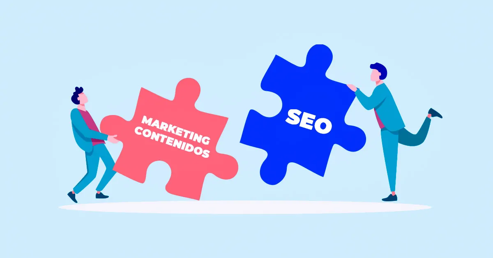
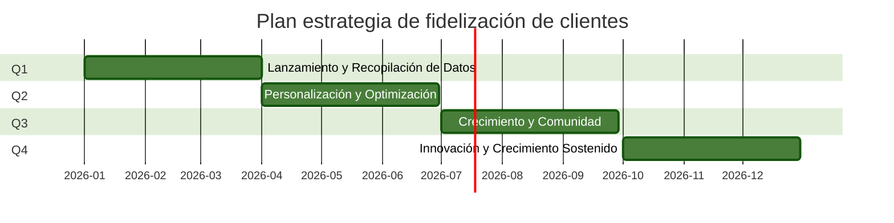

# Estrategia de Fidelización 💖:

La fidelización de clientes es tan importante como la captación. Un cliente fiel no solo repite la compra, sino que también se convierte en un embajador de la marca. Esta estrategia se centra en la etapa post-compra, utilizando herramientas digitales para nutrir la relación y asegurar que la experiencia del cliente (CX) sea excepcional.

Algunos pasos para contemplar en esta estrategia:

 

Al implementar estas herramientas, EcoSmart puede crear una estrategia de fidelización que no solo aumenta el valor de vida del cliente (CLV), sino que también construye una comunidad de defensores de la marca.

## Plan de Fidelización Digital

## Q1: Lanzamiento y Recopilación de Datos

El objetivo principal es sentar las bases de la estrategia de fidelización y comenzar a interactuar con los clientes post-compra.

**Mes 1**:

-   **Configuración de Herramientas**: Implementar y configurar una plataforma de email marketing y un sistema de gestión de clientes (CRM) que permita la segmentación de la audiencia y la automatización.

-   **Creación de Plantillas**: Diseñar plantillas para correos electrónicos de bienvenida, confirmación de compra y encuestas de satisfacción.

-   **Segmentación Inicial**: Crear segmentos de clientes basados en la fecha de compra para los primeros envíos de correos electrónicos post-compra.

**Mes 2**:

-   **Lanzamiento de Encuestas de Satisfacción**: Enviar encuestas de satisfacción a los clientes 7 días después de la entrega del producto para recopilar comentarios iniciales y medir la experiencia con la logística y el primer uso.

-   **Campaña de Onboarding por Email**: Lanzar una serie de correos electrónicos de bienvenida para guiar a los nuevos clientes en el uso de su producto y para educarlos sobre los beneficios adicionales que ofrece EcoSmart, como el monitoreo de consumo y los consejos de uso.

**Mes 3**:

-   **Análisis del Feedback**: Recopilar y analizar los datos de las encuestas para identificar los primeros puntos de dolor o áreas de oportunidad en la experiencia del producto (PX) y del cliente (CX).

-   **Configuración de Notificaciones Push**: Configurar las notificaciones push personalizadas en la aplicación móvil para enviar mensajes basados en el comportamiento del usuario.

## Q2: Personalización y Optimización (Meses 4-6)

El objetivo es utilizar los datos recopilados para personalizar la comunicación y optimizar las herramientas de fidelización.

**Mes 4**:

-   **Creación de Contenido de Valor**: Crear contenido de valor para los correos electrónicos, como tutoriales avanzados, estudios de caso sobre el ahorro de energía y noticias sobre la empresa.

-   **Segmentación Avanzada**: Segmentar a los clientes basándose en el tipo de producto que compraron para enviarles contenido y ofertas más relevantes.

-   **Lanzamiento de Notificaciones Proactivas**: Implementar notificaciones push que alerten a los usuarios sobre posibles problemas o que les ofrezcan consejos para optimizar el rendimiento del producto.

**Mes 5**:

Programa de Reseñas y Testimonios: Implementar una campaña automatizada de correo electrónico que incentive a los clientes satisfechos a dejar una reseña en el sitio web o en plataformas de terceros.

-   **Pruebas A/B en Email Marketing**: Realizar pruebas A/B en los correos electrónicos para optimizar las tasas de apertura y clics.

**Mes 6**:

-   **Medición de KPIs**: Evaluar los KPIs de fidelización (NPS, CLV, tasa de retención) y comparar los resultados con los objetivos trimestrales definidos en los OKRs.

-   **Ajuste de Estrategia**: Ajustar la estrategia de fidelización en función de lo que ha funcionado mejor y los comentarios de los clientes.

## Q3: Crecimiento y Comunidad (Meses 7-9)

El objetivo es fortalecer la relación con los clientes y fomentar la lealtad a largo plazo, además de generar boca a boca.

**Mes 7**:

-   **Lanzamiento del Programa de Lealtad**: Poner en marcha un programa de puntos o recompensas para las compras repetidas o las referencias, lo cual motiva a los clientes a regresar a la marca.

-   **Lanzamiento de la Comunidad de Usuarios**: Crear una comunidad en línea (en redes sociales o en un foro del sitio web) donde los clientes puedan interactuar entre sí y compartir sus experiencias.

**Mes 8**:

-   **Campaña de Venta Cruzada**: Utilizar el email marketing y las notificaciones push para ofrecer productos complementarios a los clientes basándose en su historial de compras.

-   **Lanzamiento de Referidos**: Lanzar un programa de referidos donde los clientes actuales obtengan una recompensa por cada nuevo cliente que traigan a EcoSmart.

**Mes 9**:

-   **Análisis de la Comunidad**: Medir la participación y el compromiso en la comunidad de usuarios.

-   **Evaluación del Impacto**: Evaluar el impacto del programa de lealtad y las campañas de venta cruzada en el valor de vida del cliente (CLV).

## Q4: Innovación y Crecimiento Sostenido (Meses 10-12)

El objetivo es asegurar que la estrategia de fidelización sea sostenible a largo plazo y que se adapte a las necesidades cambiantes de los clientes.

**Mes 10**:

-   **Recopilación de Feedback Avanzado**: Utilizar encuestas más detalladas para obtener una visión más profunda sobre las necesidades y deseos de los clientes.

-   **Análisis Predictivo**: Utilizar datos del CRM para predecir cuándo los clientes podrían necesitar un reemplazo o una actualización y enviarles ofertas personalizadas.

**Mes 11**:

Innovación en la Experiencia: Explorar nuevas formas de utilizar la aplicación móvil para mejorar la experiencia de uso del producto (PX), como nuevas funcionalidades o herramientas de monitoreo.

-   **Planificación del Siguiente Año**: Utilizar los datos y aprendizajes para planificar los OKRs y la estrategia de fidelización para el siguiente ciclo.

**Mes 12**:

-   **Análisis Anual y Retrospectiva**: Realizar un análisis completo del rendimiento anual de la estrategia de fidelización y su impacto en el valor de vida del cliente.

-   **Celebración**: Reconocer los logros del equipo y celebrar el éxito de la transformación digital.

