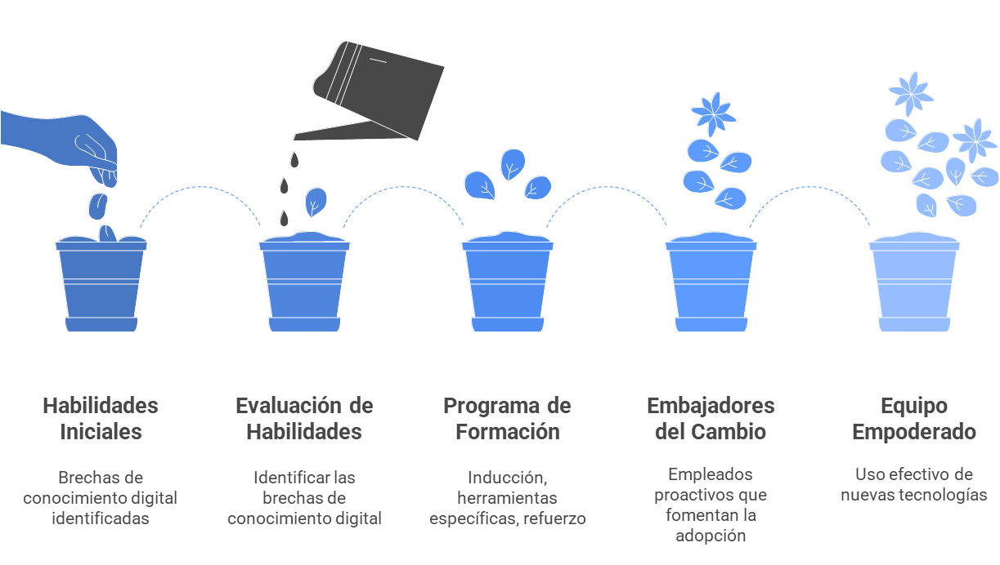

# Estrategia de Gestión del Cambio

Para implementar con éxito la transformación digital de EcoSmart, se necesita una estrategia de gestión del cambio que se enfoque en el personal y la cultura de la empresa. La adopción de nuevas herramientas digitales y un enfoque más centrado en el cliente dependen de la capacidad de la organización para gestionar la transición.

## Formación y Capacitación del Personal

La formación es un pilar fundamental para asegurar que los equipos puedan utilizar las nuevas tecnologías de manera efectiva. Para lo cual se debe contemplar los siguientes pasos de evolución.

 
 

 
 

## Adaptación de la Cultura Organizacional

La transformación digital no es solo una cuestión de tecnología, sino también de cultura. La estrategia debe fomentar una mentalidad orientada al cliente y a la mejora continua.

 
 

 
 

Al combinar una formación práctica con una adaptación cultural, EcoSmart puede abordar la resistencia al cambio y asegurar que la digitalización se convierta en una parte integral de la cultura de la empresa. Los empleados que comprenden el "porqué" de los cambios se sentirán más motivados para apoyar la transformación y contribuir al éxito.

