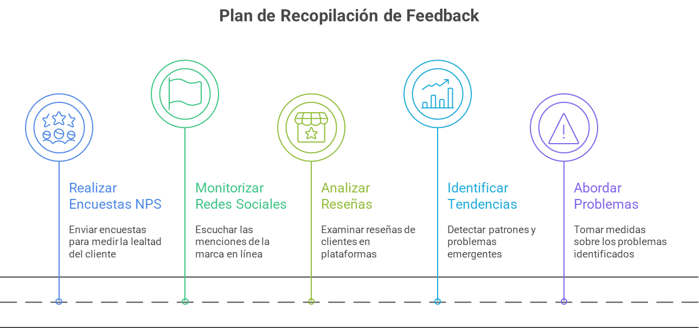
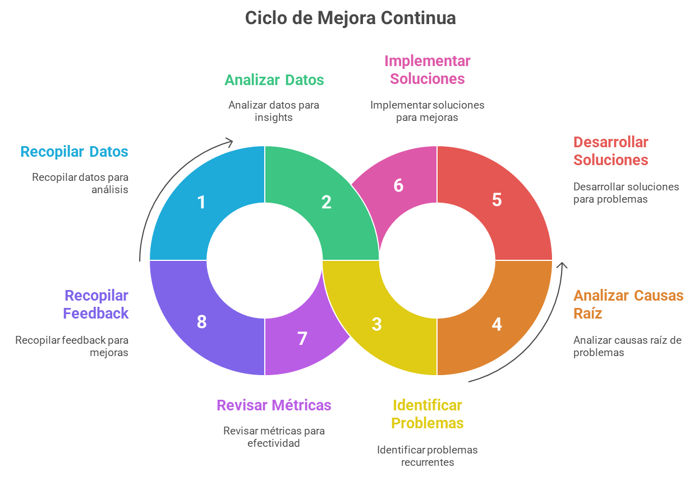

# Monitoreo y Mejora Continua

El éxito a largo plazo de la transformación digital de EcoSmart depende de su capacidad para escuchar a los clientes, analizar los datos y ajustar constantemente su estrategia. El monitoreo y la mejora continua son cruciales para mantener la relevancia y la ventaja competitiva.
 
 
La implementación de este pilar se basa en dos áreas clave: la recopilación de feedback continuo y la implementación de un sistema de mejora iterativa.

 

## Plan de Recopilación de Feedback Continuo del Cliente

Para obtener una visión integral de la experiencia del cliente, EcoSmart debe emplear una variedad de herramientas y estrategias que capturen la voz del cliente (VoC).

 
 

## Implementación de un Sistema de Mejora Continua

Recopilar datos es solo el primer paso. El verdadero valor reside en cómo EcoSmart utiliza esa información para optimizar la experiencia del cliente y del producto.

 
 

