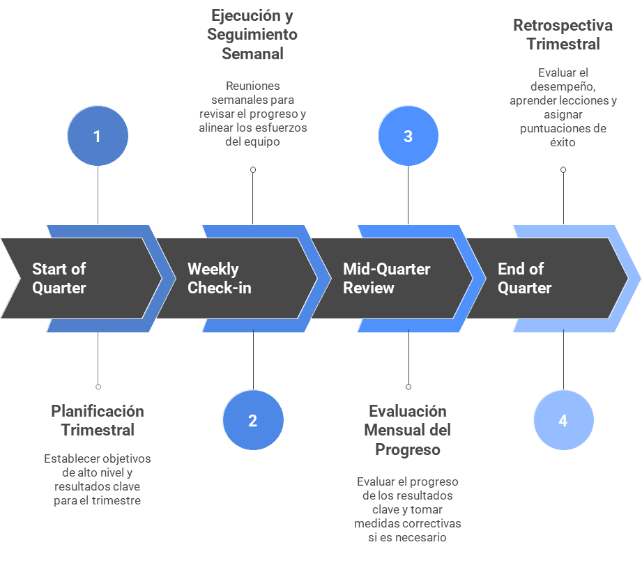

# Modelo de Trabajo para la Implementación de OKRs

## 1. Planificación (Trimestral)

La fase de planificación es la más importante y ocurre al comienzo de cada trimestre. Durante este período, se establecen los objetivos de alto nivel para la organización, se definen los equipos y los roles de cada uno de ellos.

Definición de Objetivos (O): Se eligen entre 3 y 5 objetivos de alto impacto para la empresa o el equipo. Estos deben ser ambiciosos, inspiradores y cualitativos. Deben responder a la pregunta: "¿Qué queremos lograr?". Los objetivos deben ser desafiantes pero alcanzables.

Definición de Resultados Clave (KR): Para cada objetivo, se establecen de 2 a 4 resultados clave. Estos son los resultados medibles que indican si el objetivo se ha logrado o no. Deben ser específicos, medibles, alcanzables, relevantes y con un plazo de tiempo definido (SMART). Los KR deben responder a la pregunta: "¿Cómo sabremos si lo logramos?".

Asignación de Responsabilidades: Se asigna un propietario a cada objetivo y resultado clave. El propietario es responsable de liderar el esfuerzo para alcanzar el KR.

## 2. Ejecución y Seguimiento (Semanal)

Una vez que los OKRs están definidos, la fase de ejecución se enfoca en el seguimiento constante del progreso.

Sesiones de Check-in semanales: Los equipos se reúnen semanalmente para revisar el progreso de los KRs. En estas reuniones, cada miembro del equipo comparte sus avances, los obstáculos encontrados y los planes para la próxima semana. Es importante que estas sesiones sean breves y se centren en los datos.

Alineación: Se asegura que los OKRs del equipo estén alineados con los de la empresa. Si un equipo se da cuenta de que su trabajo ya no contribuye al objetivo general de la empresa, es necesario hacer ajustes.

Comunicación Transparente: El progreso de los OKRs debe ser visible para toda la organización. Se pueden utilizar herramientas como paneles de control digitales o tableros para mostrar el estado de cada KR, en tiempo real.

## 3. Análisis (Mensual y Trimestral)

La fase de análisis permite evaluar el progreso y aprender de la experiencia.

Evaluación del Progreso (Mensual): A mitad del trimestre, se evalúa si los KRs se están cumpliendo al ritmo esperado. Si un KR está en riesgo, se deben tomar medidas correctivas o incluso renegociarlo.

Retrospectiva Trimestral: Al final del trimestre, se realiza una retrospectiva para evaluar el desempeño. Es el momento de responder a las siguientes preguntas:

¿Se lograron los objetivos?

¿Qué funcionó bien y qué no?

¿Qué se puede aprender para el próximo ciclo?

Puntuación: Se le asigna una puntuación a cada KR para determinar su éxito. Un resultado exitoso generalmente se considera que está en el rango de 0,7 a 1,0. Si un equipo constantemente logra una puntuación de 1,0, sus objetivos pueden no ser lo suficientemente ambiciosos. Si la puntuación es baja, se necesita analizar las causas y hacer correcciones.

