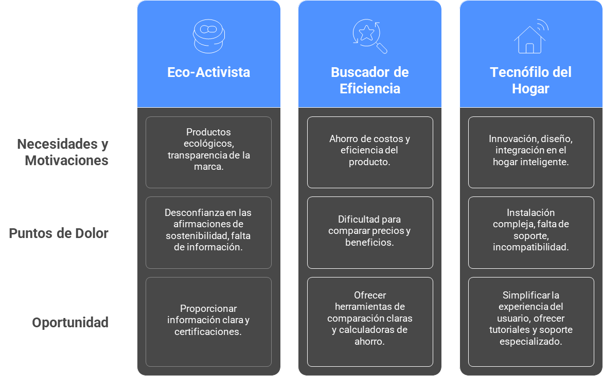

# Definición de Perfiles de Cliente Clave (Personas)

La definición de perfiles de cliente es fundamental para entender sus necesidades, expectativas y puntos de dolor. EcoSmart puede segmentar su mercado en función de criterios conductuales, demográficos, geográficos, psicográficos y socioeconómicos.

## Perfiles de Cliente EcoSmart

