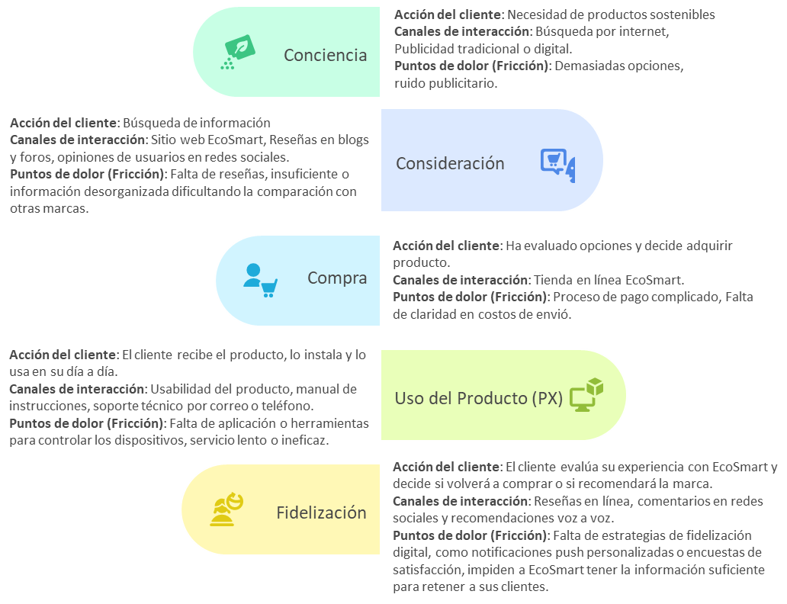
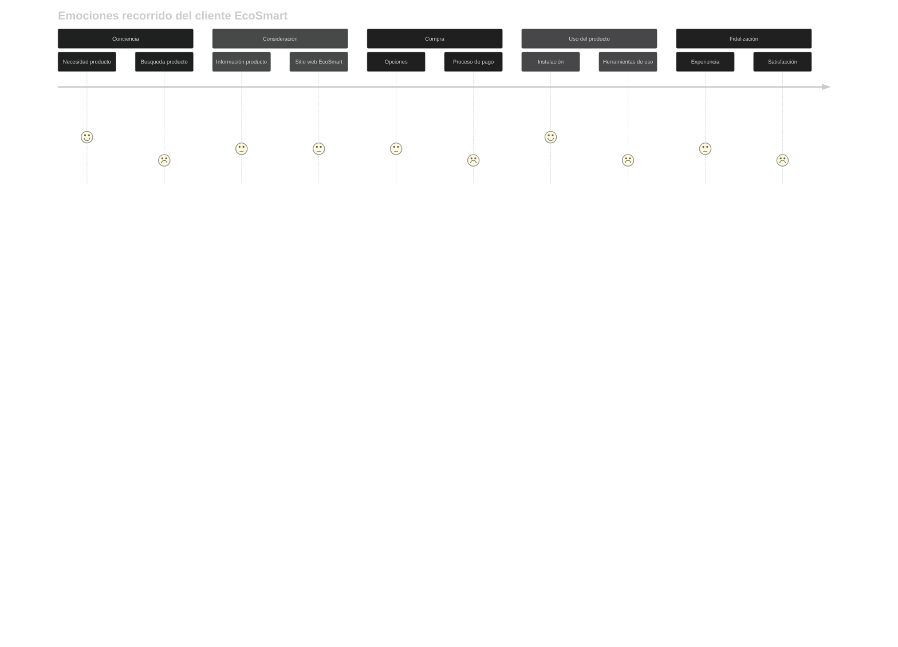

# Situación Actual

El cliente digital actual está hiperconectado, informado y es más exigente que nunca. En este contexto, EcoSmart enfrenta el desafío de captar y fidelizar clientes en un mercado competitivo. Para mejorar, se necesita un análisis detallado del recorrido del cliente (Customer Journey Map) para identificar los puntos de contacto actuales, las áreas de fricción y las oportunidades de mejora.

## Recorrido del Cliente Actual (Customer Journey Map)

## Emociones recorrido del cliente EcoSmart

Para visualizar el gráfico, realizar:

1. Para pantalla táctil, utilice los dedos para hacer zoom y moverse en el gráfico.
2. Para pantallas convencionales, oprimir la tecla alt + scroll del mouse, ubicando el puntero del mouse en la sección que desee ampliar.

Emociones relacionadas:

* :blush: Satisfecho
* :confused: Poco Satisfecho
* :disappointed: Insatisfecho

