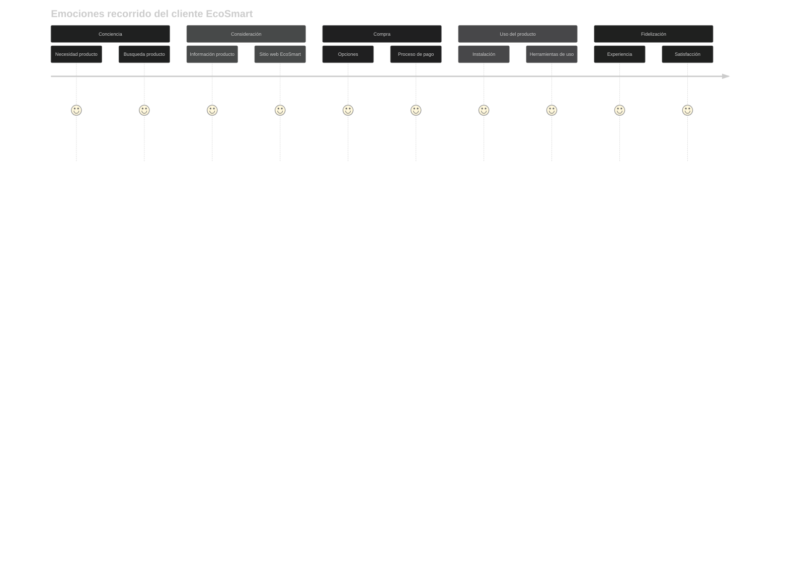

# Mapa de la Experiencia del Cliente Futura

El Customer Journey Map ideal para EcoSmart se centra en el cliente a lo largo de todo su ciclo de vida, integrando tecnologías digitales para crear una experiencia fluida, personalizada y memorable. Este modelo va más allá del simple proceso de compra, enfocándose en la construcción de una relación duradera con el cliente.

## Recorrido del Cliente Futuro (Customer Journey Map)

## Emociones futuras recorrido del cliente EcoSmart

El cliente se siente valorado y apoyado. Una experiencia positiva y consistente genera fidelización y lealtad.

Para visualizar el gráfico, realizar:

1. Para pantalla táctil, utilice los dedos para hacer zoom y moverse en el gráfico.
2. Para pantallas convencionales, oprimir la tecla alt + scroll del mouse, ubicando el puntero del mouse en la sección que desee ampliar.

Emociones relacionadas:

* :blush: Satisfecho
* :confused: Poco Satisfecho
* :disappointed: Insatisfecho

